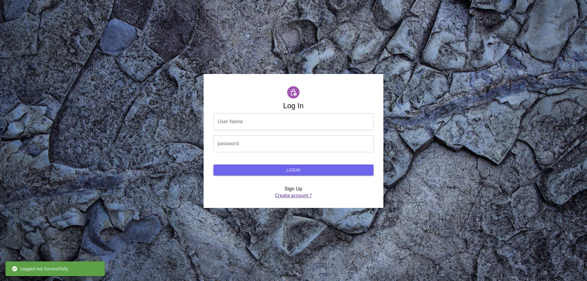

# Todo App

A to-do app is a software application designed to help individuals or teams organize and manage tasks
and activities. The primary purpose of a to-do app is to assist users in keeping track of what needs
to be done

## Getting started

## Installation:

node v18.16.0

npm v9.5.1

yarn v1.22.19

Docker version 24.0.1, build 6802122

## To add dependencies

```
yarn install
```

## Database

THe following command will bring up the database at 2718 port

```
docker compose up
```

## Environment file for backend server

- Create a .env file at path `packages/services/.env` and copy down the default content in the .env

```
    PORT=12345
    DB_PORT=27017
    DB_HOST=localhost
    DB_NAME=todo-app
    JWT_SECRET_KEY=todo-app
    MONGO_DB_URI=mongodb://localhost:2718
```

## Server

```
yarn start:service
```

- This will bring the Backend NestJS service up at 12345 by default

## Web-client

```
yarn start:client
```

- This will bring the Frontend React service up at 12345 by default

## To Visit App:

localhost:3000/

## Project Screen Shot(s)

](public/image-1.png)



### What improvements would have been done in more time?

1. Would have imprved the auth mechanism with refresh tokens. As of now it is just issuing tokens and we have just made it for demo purposes of this task
2. Error handling could be improved at BE and FE side
